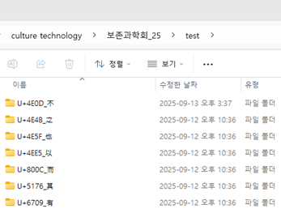
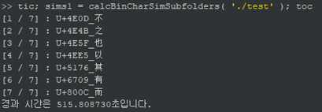
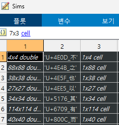

# simchar : Character similarity calculation (MATLAB)

아래와 같이 한 책(‘test’)에서 얻어진 글자들이 서브 폴더로 들어가 있는 폴더가 “C:\~~\test”일 때, simchar 내 calcBinCharSimSubfolders.m을 실행한다.
-	글자 영상을 담고 있는 서브 폴더만 있어야 함

*폴더 구조*




```MATLAB
Sims = calcBinCharSimSubfolders( ‘C:\~~\test’ )
```

*실행 예*



얻어진 Sims는 셀배열로, 행이 글자 폴더 개수만큼 있고, 3열이 들어가 있다.
1열에는 각 글자 폴더 내 글자 영상끼리 서로 비교한 유사도 행렬이, 2열에는 사용된 글자 영상의 파일이름, 3열에는 서브 폴더명(위 예에서는 ‘U+4E0D_不’)이 들어간다.

*결과 예*



calcBinCharSimSubfolders 함수 안에서 각 서브 폴더마다 calcBinCharSimFolder 함수를 호출

## calcBinCharSimFolder 함수
-	두번째 인자로 함수 핸들 셀배열을 넘겨 폴더 내 글자 영상 비교 시 어떤 방식(함수)으로 정합을 할지, 어떤 함수로 비교할지 넘겨줌 (기본: funcs = {@iou, @regCharacter})
-	세번째 인자는 글자 영상을 반전할지 결정 (기본: true)
-	네번째 인자는 유사도 비교 방향 설정. {‘unidir’, ‘bidir’} ‘unidir’은 img1을 기준으로 img2를 정합해 측정하고, ‘bidir’은 img1 기준으로 img2 정합해 측정한 유사도값과 img2 기준으로 img1 정합해 측정한 유사도값의 평균을 구함 (기본: ‘unidir’)
